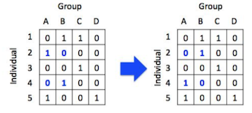

```{r setup, include=FALSE}
library(knitr)
knitr::opts_chunk$set(fig.width=4, fig.height=3.5, message=F) 
set.seed(2)
```

Packages you'll need:
```{r message=F}
library(asnipe)
library(igraph)
library(assortnet)
```

-----

Thus far, we have learned how to measure empirical networks in a variety of ways. However, we are often not satisfied with simply constructing and measuring networks. What we really want to know is: does our empirical network show some patterns that deviates from a random process? 

This brings us to hypothesis testing--that is, we want to compare the properties of our networks against some baseline, i.e., a null hypothesis/model. That is, we can ask the question: is our network non-random? 

The problem with this simplistic question, however, is that no real network is ever random. There are a multitude of factors that make networks deviate from an idealized Erdös-Renyí random graph (see [7. Random Graphs](07_randomnets.html)) 

Because most networks are complex and relational data do not conform to the requirement of non-independence of data, we often use randomizations/permutations to generate null models against which we can compare the empirical data. Here, we focus narrowly on some classic forms of null model hypothesis testing using randomizations. In the context of animal social networks, there have been a couple of good review and tutorial of this method (Croft et al. 2011; Farine & Whitehead 2015). We will provide a quick overview here.

##8.1 Node-label Permutations

Node-label permutations involve shuffling the node type or node values (e.g., sex, size, etc.) randomly across all nodes in a network, while keeping the edges the same. This ensures that the inherent structural pattern of the network remains the same, but the node values are randomized. This type of randomization scheme may be appropriate when you are interested in understanding how node attributes affect connectivity of nodes, e.g.:

(a) testing correlations between node attribute and network position 
(b) using as null model for assortativity

```{r, echo=F}
##figures
set.seed(2)
n=20
p=0.1
g1=erdos.renyi.game(n, p=0.4)
V(g1)$trait=sample(c(1,2), n, prob=c(p, 1-p), replace=T)
g2=erdos.renyi.game(n, p=0.4)
V(g2)$trait=sample(c(1,2), n, prob=c(1-p, p), replace=T)
g3=g1+g2

for(i in 1:20){
  g3=add_edges(g3,c(sample(1:n, 1), sample((n+1):(n*2),1)))
}

#plot(g3, vertex.color=c("tomato", "gold")[V(g3)$trait], vertex.label="", layout=layout_in_circle(g3), edge.color="black")

V(g3)$trait.random1=sample(V(g3)$trait, length(V(g3)$trait), replace=F)
V(g3)$trait.random2=sample(V(g3)$trait, length(V(g3)$trait), replace=F)
V(g3)$trait.random3=sample(V(g3)$trait, length(V(g3)$trait), replace=F)
```
```{r, echo=F, fig.width=6, fig.cap="Illustration of node label permutation: The node labels in the large graph has been permuted in three different versions." }
layout(matrix(c(1,1,1,2,3,4), byrow=F, nrow=3))
par(mar=c(1,1,1,1))
plot(g3, vertex.color=c("red", "gold")[V(g3)$trait], vertex.label="", layout=layout_in_circle(g3), edge.color="black")
plot(g3, vertex.color=c("red", "gold")[V(g3)$trait.random1], vertex.label="", layout=layout_in_circle(g3), edge.color="black")
plot(g3, vertex.color=c("red", "gold")[V(g3)$trait.random2], vertex.label="", layout=layout_in_circle(g3), edge.color="black")
plot(g3, vertex.color=c("red", "gold")[V(g3)$trait.random3], vertex.label="", layout=layout_in_circle(g3), edge.color="black")
```


**You can find a worked example of the node-label permutation test in the worked example based on a study by Firth & Sheldon (2015) called “Testing assortment of RFID-tagged birds in Whytham Woods”** (To be posted soon)

<br>


##8.2 Edge Permutations

May be appropriate when:

* Not necessarily testing for the roles of particular node types
* Testing whether structure of network is non-random... but what is random?
* Must be careful about exactly how we permute edges--do we want to preserve any aspect of the connectivity of nodes?

###8.2.1 Unconstrained edge permutations

One straight-forward way to randomize edges in a network is to generate ‘random graphs’ in which there are the same number of nodes and edges as the empirical network, but the edges are now distributed randomly. One can create such networks by generating a ‘Erdös-Renyí random graph’ or by ‘rewiring’ the network randomly.

###8.2.2. Edge rewiring while keeping the degree distribution constant

Alternatively, we may want to ask whether the degree distribution itself may affect the clustering coefficient of the network. That is, if the distribution of node degrees is non-random, that alone may cause the clustering coefficient to be larger than expected by Erdös-Renyí random graph. We can implement this with the `rewire()` function as well, with a different method.
I’ll briefly explain how this edge rewiring method works. This method is sometimes called the “switching” algorithm because it works by identifying two edges that connect different pairs of edges and then switches the ends of these nodes (illustrated below). Milo et al. (2003) found that this method works well and produces a randomized graph after implementing this switching step $m$ number of times, where $m$ is the number of edges in the network.


###8.3 Group membership permutation

The edge randomization with constant degree sequence as described above preserves much more of the network structure than a completely random graph. However, these edge randomization methods are both using association indices that are non-random based on the group membership of individuals. An alternative way to conduct a randomization is to permute the group membership data (i.e., the original group-by-individual matrix) such that we randomize which group (e.g., flock) that each individual is in. Now I will explain how the group membership swapping works. This method is sometimes called the “swap algorithm”, or “flipping procedure”. It is actually the same algorithm that community ecologists use to generate a null model for species co-occurrences (see Manly 1995; Gotelli 2000; Ulrich & Gotelli 2007). It has been adapted for generating a null model for social associations in animals by Bejder et al. (1998) and advocated for use in social network studies (Whitehead et al. 2005).


Step 1: Identify a 2x2 sub-matrix within the bipartite matrix that looks like:
$\begin{bmatrix} 0 & 1 \\ 1 & 0 \\ \end{bmatrix}$

Step 2: Swap the row/columns so that the 2x2 matrix looks like:
$\begin{bmatrix} 1 & 0 \\ 0 & 1 \\ \end{bmatrix}$



There are generally two ways to generate a P-value using the group membership swapping algorithm. First, one could repeat the swaps until the test statistic of interest (modularity in this case) stabilizes to a range of values corresponding to a randomized matrix, and then repeat this procedure a large number of times, say 1,000 times, to calculate a distribution of the test statistic under the null model (let’s call it the ‘global test’). Alternatively, one can run a large number of swaps from a single initial matrix, calculating a test statistic after each ‘swap’ of the matrix, and compare this distribution against the empirical test statistic (‘serial test’). Manly (1995) discusses why the serial method is a valid method for testing whether the empirical matrix is non-random as long as we conduct a very large number of swaps. I will not get into the logic behind this: I highly recommend reading the Manly (1995) and references therein. The ‘serial test’ method is much more computationally efficient than the ‘global test’.

##8.4 Which randomization is right for you?

The choice of permutation strategy depends fundamentally on the question you want to ask. 
Is your question about the role of node attributes in the structure of the network? If so, then you might consider a node label permutation method. 
Is your question about 


```{r}
#use UK faculty
library(igraphdata)
data(UKfaculty)
ukf=simplify(UKfaculty)
ukf=as.undirected(ukf)
ukf
```
Node-label permutation
```{r}
setup=layout(matrix(c(1,1,1,2,3,4), 2,3, byrow=T))
par(mar=c(1,1,2,1))
l=layout_with_fr(ukf)
plot(ukf,layout=l, vertex.color=c("tomato", "slateblue", "yellow", "green")[V(ukf)$Group], vertex.label="", vertex.size=10, main=list("original", cex=2))

for (i in 1:3){
  V(ukf)$color=c("tomato", "slateblue", "yellow", "green")[sample(V(ukf)$Group, vcount(ukf),  replace=F)]
  plot(ukf,layout=l, vertex.label="", vertex.size=10, main=paste("Permutation ", i, sep=""))
}

hist(degree(ukf))

```
Edge permutation (unconstrained)
```{r}
#
setup=layout(matrix(c(1,1,1,2,3,4), 2,3, byrow=T))
par(mar=c(1,1,2,1))
l=layout_with_fr(ukf, weights=E(ukf)$weight)
plot(ukf,layout=l, vertex.color=c("tomato", "slateblue", "yellow", "green")[V(ukf)$Group], vertex.label="", vertex.size=10, main=list("original", cex=2), edge.width=E(ukf)$weight/5)

for (i in 1:3){
  ukf2=rewire(ukf, each_edge(prob=1))
  plot(ukf2,vertex.label="", vertex.size=10, main=paste("Permutation ", i, sep=""))
}
```

Edge rewiring
```{r}

setup=layout(matrix(c(1,1,1,2,3,4), 2,3, byrow=T))
par(mar=c(1,1,2,1))
l=layout_with_fr(ukf, weights=E(ukf)$weight)
plot(ukf,layout=l, vertex.color=c("tomato", "slateblue", "yellow", "green")[V(ukf)$Group], vertex.label="", vertex.size=10, main=list("original", cex=2), edge.width=E(ukf)$weight/5)

for (i in 1:3){
  ukf3=rewire(ukf, keeping_degseq(niter=vcount(ukf)))
  plot(ukf3,vertex.label="", vertex.size=10, main=paste("Permutation ", i, sep=""))
}
```