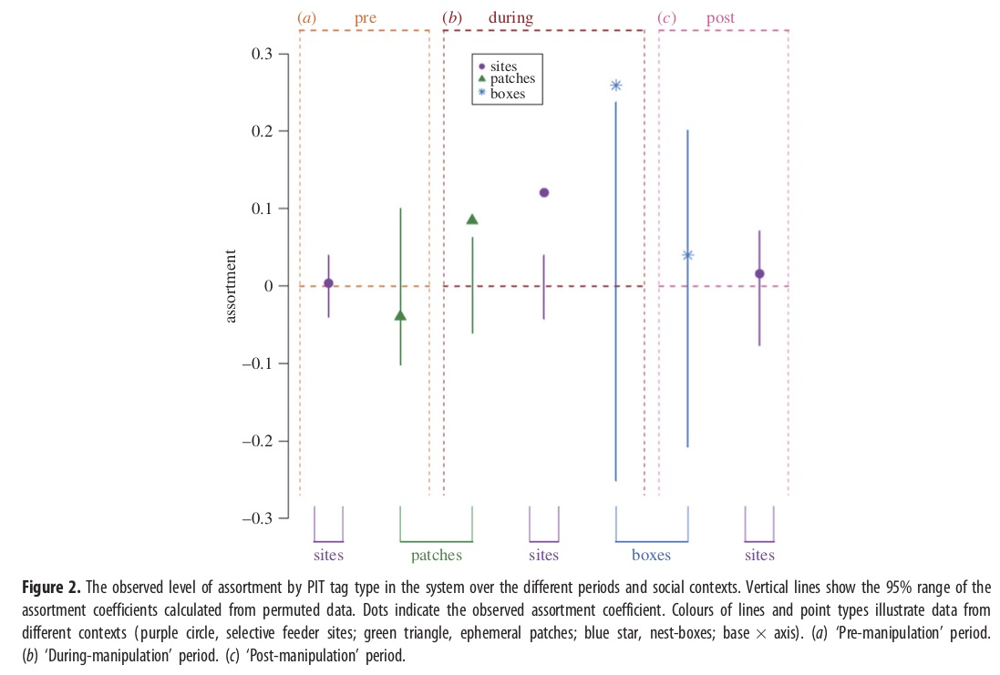

This exercise will based on a study by Firth & Sheldon (2015) using several species of birds in Wytham Woods, Oxford. This is a fantastic system in which great tits (*Parus major*), blue tits (*Cyanistes caeruleus*), marsh tits (*Poecile palustris*), coal tits (*Periparus ater*) and Eurasian nuthatches (*Sitta europaea*) have been tagged with RFID tags, and they are given access to feeders that are connected to RFID readers. In this study, Firth & Sheldon manipulated access to feeders based on an arbitrary criterion (odd vs. even-numbered RFID tags) and observed that this artificial segregation of co-feeding birds lead to corresponding assortment of birds that feed at those sites. Moreover, this new segregation of co-feeding relationships bled over to other contexts (‘ephemeral’ open feeding sites and nestbox inspections).

Here, we will take the opportunity to re-create a part of Figure 2 of this study, which plots the assortment coefficient of the networks at different time periods and contexts and compares these values to the expected values based on permutation method called ‘node-label permutation’.

##Importing and using .RData file

To do this, we will first have to import the publicly-accessible dataset associated with the Firth & Sheldon (2015) study. This is available on the Dryad Data Repository.
You can load R Data Files using the `load()` function. Here, we will just load it straight from the dryad website:

```{r, eval=F}
load(url("http://datadryad.org/bitstream/handle/10255/dryad.71301/figure2data_wholenetworks. RData"))
```

```{r, echo=F}
load("SampleData/figure2data_wholenetworks.RData")
```
You should see that this loads several objects that the authors have compiled into a convenient packet:

- `description`: a simple written description of the data

- `id.info`: a vector of 339 values, corresponding to each individual in the networks. The value is 1 if the individual has an odd-numbered tag and 0 if it has an even-numbered tag.

- `whole.networks`: a list object with 7 adjacency matrices. This corresponds to the 7 lines and dots in Figure 2 (though not in exact order).

The whole.network object is key here. Let’s look at its structure using the `str()` function:

```{r}
str(whole.networks)
```

So, there are 7 components and each component is a matrix of slightly different dimensions (e.g., ‘pre.site.whole.network’ is 203 x 203, while ‘during.site.whole.network’ is 336 x 336). Let’s take a look at one of the networks. We’ll take the first adjacency matrix (the pre-experimental network for the whole site), convert it into an igraph object, and then plot it:

```{r}
library(igraph)
g.pre=graph_from_adjacency_matrix(whole.networks[[1]], mode="undirected", weighted=T)
set.seed(2)
lay.pre=layout_with_fr(g.pre) # this will say a layout that we can use in subsequent versions of the network plot
plot(g.pre, edge.width=E(g.pre)$weight*10, vertex.label="", vertex.size=5, layout=lay.pre)
```

Now, let’s try to add whether the individual had an odd- or even-numbered tag. To do this, we have to link the `id.info` information with the node names. The node names in the adjacency matrices corresponds to the order of individuals in the id.info vector. What we will do is first create a separate data frame object that links the node name to the RFID tag type. We can then use this information to create a node attribute for the network by matching the node name with the id name in this data frame we created:

```{r}
#create a data frame in which the first column is the "id number" and the second column is 1-odd or 0-even. **Note that we can name the columns within the `data.frame()` function 
rfid.dat=data.frame(id=as.factor(1:339), oddeven=id.info)
head(rfid.dat) #take a look at what we did.

#look up the appropriate node name in the rfid.dat object and return the odd-or-even data.
V(g.pre)$oddeven=rfid.dat[match(V(g.pre)$name, rfid.dat$id), "oddeven"]
```

Take a look at the `V(g.pre)$oddeven` attribute now and see what this did.

Now, we can use this to create a separate “node color” attribute and use this to plot the network.

```{r}
#create node color attribute based on odd (blue) or even (red) tags.
V(g.pre)$node.color=c("red","lightblue")[V(g.pre)$oddeven+1]

#plot the network using the node colors
plot(g.pre, vertex.color=V(g.pre)$node.color, edge.width=E(g.pre)$weight*10, vertex.label="", vertex.size=5, edge.color="black", layout=lay.pre)
```

Try doing this with the other networks, such as the “during experiment” network (the second element in the `whole.networks` list object).

```{r}
g.during=graph_from_adjacency_matrix(whole.networks[[2]], mode="undirected", weighted=T) 
V(g.during)$oddeven=rfid.dat[match(V(g.during)$name, rfid.dat$id), "oddeven"] 
V(g.during)$node.color=c("red", "lightblue")[V(g.during)$oddeven+1]

plot(g.during, vertex.color=V(g.during)$node.color, edge.width=E(g.during)$weight*20, vertex.label="", vertex.size=5, edge.color="black") 
```

Now, you might notice some visual differences in this network, but it’s actually quite difficult to get any sense of definitive differences here. We now want to directly measure the network metric of interest: assortativity. 

---

##Measuring Assortativity using the `assortnet` package

Assortativity coefficient for both discrete and continuous traits (in weighted or unweighted networks) can be calculated using the R package ‘assortnet’ (Farine 2014).
First, let’s load the assortnet package and use the `assortment.discrete()` function to calculate the assortativity index based on odd vs. even RFID tag in the pre-treatment period and look at the result. Note that this function takes the adjacency matrix, not the igraph object:

```{r}
library(assortnet)

#use the first adjacency matrix in the whole.networks list object: this is the pre-treatment period network
r.pre=assortment.discrete(whole.networks[[1]], V(g.pre)$oddeven)
r.pre
```

You can see that the `assortment.discrete()` function actually returns two elements: the $r$ value (assortativity index) and the “mixing matrix”, which shows how the r value is calculated—we will actually not use the mixing matrix here.

If you want to just return the assortativity index:

```{r}
r.pre$r
```

Now try this with the “during-treatment” network:

```{r}
r.during=assortment.discrete(whole.networks[[2]], V(g.during)$oddeven) 
r.during$r
```

You can see that the assortativity coeffecient is much higher during the experiment ($r_{during}=0.121$) than the pre-experiment period ($r_{pre}=0.003$). You should also see that the these ‘pre-treatment’ and ‘during-treatment’ assortativity values correspond to the purple circles in Figure 2a and 2b, respectively.

##Null Hypothesis Testing using node-label permutation

So far, we have calculated the assortativity coefficient of the bird social network in the pre- and during-treatment periods and showed that there is greater assortativity during the treatment. However, since there is no replication of the experiment, it is difficult to say whether or not this comparison is meaningful. What we would like to do is actually compare these values to the “null expectation”—the level of assortativity we would expect if the connections between node types were random.
One potential way to ask whether the observed assortativity is non-random would be to compare the observed assortativity values with random graphs of the same size, density and frequency of node types. However, there are many reasons why comparing the observed network to random graphs may not be very informative: since the pattern of connections in observed networks are almost always non-random to begin with, whatever difference between the observed and expected values may be due to the fact that patterns of connections are non-random with respect to factors that are unrelated to RFID tag numbers. A better way to ask whether the observed assortativity values are non-random would be to compare the empirical value against networks that have the exact same pattern of connections (i.e., network toplogy), but the node types are randomized across all nodes. This is what is called ‘node-label permutation’).

Implementing node-label permutation is not as difficult as you might think. The first thing you need to learn is how to “resample” a series of values. In our current case, we want to use a resampling (or permuting) procedure to randomly reassign each node to represent an odd- or even-numbered tag. You can do this by using the function `sample()`. You can see what this has done by comparing the actual RFID type of the first 6 nodes and compare it with their *permuted* values:

```{r}
s=sample(V(g.pre)$oddeven, length(V(g.pre)), replace=F) #we 'resample without replacement' the odd/even values for nodes.
head(V(g.pre)$oddeven) #first 6 values of odd/even types for the empirical data
head(s) #first 6 values of odd/even types for the permuted data
```

Note that the resampled values `s` will be different each time you run the above `sample()` function. Now, lets measure the assortativity index of this “node-label permuted” network. We can do this simply by using the same adjacency matrix, but now using the permuted version of node RFID types:

```{r}
assortment.discrete(whole.networks[[1]], s)$r
```


What we have done here is a single iteration of the permutation procedure. To do a proper statistical test, we would like to repeat this permutation a large number of iterations—say 10,000 times—and compare the distribution of assortativity values of these permuted networks with the observed assortativity value. Using this procedure, we can calculate a ***p-value of the observed assortativity index as the probability that the observed assortativity value falls within the distribution of assortativity values from the permuted networks.***

We can use a loop function to repeat this permutation procedure a large number of times. Here, we will just do 1000 permutations. We will do this permutation procedure for the “pre-treatment” network and store the resulting assortativity values into a vector called `r.pre.permutation`:

```{r}
t=1000
r.pre.permutation=vector(length=t)
for (i in 1:t){
  s=sample(V(g.pre)$oddeven, length(V(g.pre)),replace=F) 
  r.pre.permutation[i]=assortment.discrete(whole.networks[[1]], s)$r 
  }
```

The resulting `r.pre.permutation` object will now contain 1000 values. You can plot this as a histogram to visualize the data. In addition, you can draw a vertical line corresponding to the observed assortativity value and see where it falls in the distribution of these values:

```{r}
hist(r.pre.permutation)
abline(v=r.pre$r, lty=2, col="red", lwd=3) #arguments: lty = line type (2 = dashed line); col = color; lwd = line width
```

You can visually tell that the observed assortativity value falls well within the distribution of the permuted assortativity values. The corresponding p-value based on a one-tailed test would be the number of times the permuted values exceeded the observed value (r.pre$r), divided the number of permutations (*note*: some people prefer to calculate p-value from permutations by adding 1 to both numerator and denominator. There are some theoretical arguments for that. I will skip that here.):

```{r}
p.pre=(length(which(r.pre.permutation>r.pre$r))+1)/(t+1) 
p.pre
```

The exact value that you see when you run the code will differ than what you see here because this is a randomization test. But it should be somewhere around p = 0.2 or so.

Ok, let’s repeat this exercise for the “during-treatment” network:

```{r}
t=1000 
r.during.permutation=vector(length=t) 
for (i in 1:t){
  s=sample(V(g.during)$oddeven, length(V(g.during)$oddeven), replace=F)
  r.during.permutation[i]=assortment.discrete(whole.networks[[2]], s)$r 
}

hist(r.during.permutation, xlim=c(-0.06, 0.15)) #NOTE: you will need to use the xlim= argument to adjust the x-axis limits so that the empirical assortativity value will show up! 
abline(v=r.during$r, lty=2, col="red", lwd=3)
p.during=(length(which(r.during.permutation>r.during$r))+1)/(t+1) 
p.during
```

We see that the empirical assortment coefficient we see during the experimental phase is significantly different than what we would expect from random.

Now, let's do this again for the assortment value observed at feeders in the post-experimental phase:

```{r}

#start by extracting the post-experiment feeder network. 
g.post=graph_from_adjacency_matrix(whole.networks[[3]], mode="undirected", weighted=T) 
V(g.post)$oddeven=rfid.dat[match(V(g.post)$name, rfid.dat$id), "oddeven"] 
r.post=assortment.discrete(whole.networks[[3]], V(g.post)$oddeven) 
r.post$r #the empirical value

t=1000 
r.post.permutation=vector(length=t) 
for (i in 1:t){
  s=sample(V(g.post)$oddeven, length(V(g.post)$oddeven), replace=F)
  r.post.permutation[i]=assortment.discrete(whole.networks[[3]], s)$r 
}

hist(r.post.permutation, xlim=c(-0.10, 0.15)) #NOTE: you will need to use the xlim= argument to adjust the x-axis limits so that the empirical assortativity value will show up! 
abline(v=r.post$r, lty=2, col="red", lwd=3)
p.post=(length(which(r.post.permutation>r.post$r))+1)/(t+1) 
p.post
```

So, what we see is that the empirical assortment value ($r_{post}=0.016) is not different from what we'd expect by chance. 


Let's summarize the results so far--at feeders, we see significant assortment during the experiment, but not pre- or post-experiment. Here, I am plotting boxplots to show the assortment coefficient from our node-label permutations. We then put the empirical values as red "*"

```{r}
boxplot(r.pre.permutation, r.during.permutation, r.post.permutation, col=c("yellow", "tomato", "slateblue"), ylim=c(-0.1, 0.2), names=c("pre", "during", "post"))
abline(h=0, lty=2)
points(1,r.pre$r, pch="*", cex=5, col="red")
points(2,r.during$r, pch="*", cex=5, col="red")
points(3, r.post$r, pch="*", cex=5, col="red")
```

Basically, this tells us that the distribution of the expected values of assortativity index is similar in the pre-, during-, and post-treatment networks, but the observed value (red asterisk) far exceeds the expected values during the treatment. This is evidence that the experimental treatment caused assortment by RFID tag type.

##Testing the carry-over of experimental assortment into different contexts: Recreating Figure 2

So far, we've shown that the experiment works--by restricting access to feeders based on odd- or even-RFID IDs, the researchers were able to force assortment of individuals at feeders by the arbitrary criterion. But the really interesting part of the story comes from looking at assortment of individuals during these time periods at other contexts: (a) unrestricted food patches (*patches*) where RFID tags are read, but where all individuals have access, and (b) nest boxes (*nests*), where individuals come by for nest prospecting during early spring (corresponding to the during- and post-experimental period).

These results are summarized in Figure 2:

```{r}

```

The data for these contexts are all stored in the `whole.networks` object. So here, we can repeat the entire routine again for the rest of the networks stored in here. To simplify this process, let' create a function that runs through the permutation routine we ran for the feeder site networks and saves the following things:

* the network, `g`
* the empirical assortment coefficient, `r`
* the assortment coefficients from 1,000 runs of the permutation, `r.permutation`
* the 95% confidence interval--i.e., the 0.025 and 0.975th quantiles, `r.permutation.quants`

We will simply call this function `run_analysis()`
```{r}
run_analysis=function(x) {
  g=graph_from_adjacency_matrix(x, mode="undirected", weighted=T)
  V(g)$oddeven=rfid.dat[match(V(g)$name, rfid.dat$id), "oddeven"]
  r=assortment.discrete(x, V(g)$oddeven)$r
  t=1000
  r.permutation=vector(length=t)
  for (i in 1:t){
    s=sample(V(g)$oddeven, length(V(g)),replace=F) 
    r.permutation[i]=assortment.discrete(x, s)$r 
    r.permutation.quants=quantile(r.permutation, c(0.025, 0.975))
  }
  list(g=g, r=r, r.permutation=r.permutation, r.permutation.quants=r.permutation.quants) #this is the output
}
```

Let's just go ahead and run this function for all items in the `whole.networks` list. This will end up re-running the analysis for the feeder site networks we already did, but that's fine (it only takes a few seconds):

```{r}
all.results=lapply(whole.networks, run_analysis)
```

Use the `str()` function to look at what we have here. This is a list within a list... The top level is the treament, and within each treatment, we have saved the network, the observed assortment coefficient, the assortment coefficients from permuted networks, and the confidence interval of those permuted assortment coefficients. 

```{r}
str(all.results, max.level=2) #max.level=2 because there are more items nested within this list and it gets long...
```

From this `all.results` object, we will now extract just the data we need to plot Figure 2, which are: 
(1) the observed assortment coefficient
(2) the lower and upper quantiles that define the confidence intervals

```{r}
r=sapply(all.results, function(x) x$r)
lower.q=sapply(all.results, function(x) x$r.permutation.quants[1])
upper.q=sapply(all.results, function(x) x$r.permutation.quants[2])
```

Now let's look along the x-axis of Figure 2. What you need to notice that the order here is not the same order as the items in the `whole.networks` (and hence `all.results`) list. Check out that order here:

```{r}
names(whole.networks)
```

In contrast, the order of treatments in the figure is:

(1) Pre-experiment period at the feeder site (network 1 in `whole.networks`)
(2) Pre-experiment period at unrestricted food patch (network 4)
(3) During-experiment period at unrestricted food patch (network 5)
(4) During-experiment period at feeder site (network 2)
(5) During-experiment period at nest boxes (network 6)
(6) Post-experiment period at nest boxes (network 7)
(7) Post-experiment period at feeder sites (network 3)

Thus, the order in which we want to plot the results are 1, 4, 5, 2, 6, 7, 3. Let's save that as an object. While we're at it, let's also save the order of colors and shapes in Figure 2:

```{r}
treatment.order=c(1,4,5,2,6,7,3)
color.order=c("purple", "darkgreen", "darkgreen", "purple", "blue", "blue", "purple")
shape.order=c("circle", "triangle", "triangle", "circle", "asterisk", "asterisk", "circle")
```

Now, let's create a data frame that aligns the data we need in the order that we need them:

```{r}
df=data.frame(lower=lower.q[treatment.order], upper=upper.q[treatment.order], Assortment=r[treatment.order], Treatments=c("pre.site", "pre.patch", "during.patch", "during.site", "during.nest", "post.nest", "post.site"), color.order=color.order, shape.order=shape.order)

df
```

Finally, we will use ggplot2 to make the plot:

```{r, message=F}
library(ggplot2) #load ggplot2 package

p = ggplot(df, aes(x = Treatments, y = Assortment))  #define the main plot axes
p = p + theme_bw() #make simpler background
p = p + geom_linerange(aes(ymax = upper, ymin = lower), colour=color.order) #add linee for confidence interval of assortment coefficients from  permutations
p = p+ geom_point(colour=color.order, size=3, shape=shape.order) #add points for empirical assortment
p = p+ scale_x_discrete(limits=df$Treatments) #add treatment name to the x=axis
p = p+ scale_y_continuous(limits=c(-0.3, 0.3)) #define y-axis range
p = p+ geom_hline(aes(yintercept=0), linetype="dashed") #add dashed horizontal line at 0
p #plot the figure
```