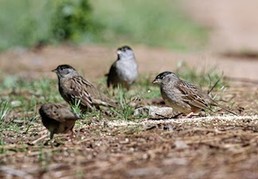

```{r setup, include=FALSE}
library(knitr)
knitr::opts_chunk$set(fig.width=6, fig.height=4, message=F, fig.align="center") 
set.seed(2)
```

-----

It's one thing to learn the basics the theory, but it's a whole other thing to learn how to actually go from observed data to a network. Because let's be real: we don't often collect data in adjacency matrix, or even edge list format. In this worked example, we will go through how to construct a network from data on flock observations.

Here are the packages you will need to load for this exercise:
```{r}
library(tidyr) #or you can just load the whole tidyverse with library(tidyverse)
library(asnipe)
library(igraph)
```

<br>

##1. Constructing sparrow networks from observed group data: Golden-crowned Sparrow flock network


One of the most common form of animal social networks is constructed from a series of observations of groups--i.e., herds, flocks, etc. The idea is to identify individuals within groups (and observe many groups), then use the pattern of co-membership in groups to define connections between individuals. In behavioral ecology, this method is often called "the gambit of the group". 

In a series of publications ([Shizuka et al. 2014](https://onlinelibrary.wiley.com/doi/abs/10.1111/ele.12304); [Arnberg et al. 2015](https://onlinelibrary.wiley.com/doi/abs/10.1111/mec.13366)), we presented the social network based on flock co-membership in a wintering population of Golden-crowned Sparrows (*Zonotrichia atricapilla*) in Santa Cruz, CA. We showed that these birds exhibit fission-fusion dynamics in which small foraging flocks form from larger 'social communities', or relatively discrete clusters of individuals that flock together often with each other (but not other members of the population).

Here, we will walk through how to make these social networks, starting with the raw data.




<br>

##2. Accessing the raw data

The raw flocking data from the Shizuka et al. 2014 paper is available to download from Dryad (www.datadryad.org). You can actually just download the data directly into R without having to download it to your computer first. Here, we will download the flock data for season 2 (which is shown in the figure above.)

```{r}
flockdat=read.csv('https://datadryad.org/bitstream/handle/10255/dryad.63925/Flock_Season2_Dryad.csv')
head(flockdat)
```

You can see that the raw data has the date & time, and the location (in grid coordinates) for each observation. The rest of the columns are the list of birds seen in that flock (in 5-digit ID code). There are up to 10 birds seen in a flock, so there are 10 columns to accommodate the largest flocks. However, most flocks don't have 10 individuals, so there are empty spaces, which are filled with "NA" here. 

<br>

##3 Converting the raw data into an individual-by-group matrix (affiliation matrix)

So, what we want to do is convert this data into one of the three main data types we can work with. Here, I will convert this raw data into an **individual-by-group matrix** (aka affiliation matrix). In this matrix, each row will be an individual and each column will be an observed flock. If the individual is in the flock, the cell value will be 1. Otherwise, it will be 0. 

###3.1 Get the bird IDs:

First step, then, is to figure out all of the individuals that are in this dataset so that we can assign each of them a row. I will do this in two steps:

We can extract the columns within the dataset that contain the bird IDs. These columns all share the word "Bird" in the column name. 

```{r}
#get the columns that contain the bird IDs.
birdcols=grep("Bird",colnames(flockdat))
birdcols
```

With this, you can easily just get the bird ID data with this line of code (output not shown)
```{r, eval=F}
flockdat[,birdcols]
```

We can then collapse this data into one column that contains all bird IDs observed in any flock for the whole dataset. This is often called 'long-format' data (as opposed to the 'wide-format' that the data is currently in). There are different ways to do this, but here is one easy way using the `gather()` function from the package `tidyr` (output not shown). 

```{r, eval=F}
gather(flockdat[,birdcols])
```

Since we can do that, all we need is to extract the unique IDs that show up in the column called 'value' within this long-format data. Here's how you can do that in one line:
```{r}
bird.ids=unique(gather(flockdat[,birdcols])$value)
bird.ids
```

Ok, so we have the IDs of all of the birds in this dataset. But notice that this also includes "NA". So let's get rid of that:
```{r}
bird.ids=bird.ids[is.na(bird.ids)==F]
bird.ids
```

<br>

###3.2 Get the individual-by-group matrix using the `match()` function

Let's think through how we are going to make this individual-by-group matrix now. What we need to do, then, is to go through each observed flock--i.e., each row of the original flock data--and ask whether bird A is in it, bird B is in it, etc. etc.We can do that using the `apply()` and `match()` functions. 

What this line of code will do is to go through the rows of the flock data (just the columns containing the bird IDs), and ask to match the bird ID in our list with the bird IDs in that line (i.e., flock). Let's try it (output not shown).

```{r, results='hide'}
m1=apply(flockdat[,birdcols], 1, function(x) match(bird.ids,x))
m1
```

What this gives you is a matrix with 47 rows (for each bird) and 353 columns (for each flock) with a number if that bird was found in that flock, and "NA" if not. So, we can simply convert this to "0 if NA" and "1 if anything else" (result not shown):

```{r, results='hide'}
m1[is.na(m1)]=0
m1[m1>0]=1
m1
```

Great, now we have our individual-by-flock matrix. Let's name the columns and rows:
```{r, results='hide'}
rownames(m1)=bird.ids #rows are bird ids
colnames(m1)=paste('flock', 1:ncol(m1), sep="_") #columns are flock IDs (just "flock_#")
m1
```

<br>

##4. Make the network

###4.1 Association Indices

A quick tutorial here on how to convert group membership to edges in a social network. There are many ways to calculate an index of association between pairs of individuals. The simplest case would be to just count the number of times a pair of individuals were seen together ($A \cap B$). However, we would often want to account for the fact that some birds are seen often while others are seen rarely. Thus, what we really want to know might be *how often a pair of birds are seen together, given the number of times they were seen at all*? This is the essence of an association index. These were presented in a now-classic paper by Cairns & Schwager (1987). 

Here, we will use what is called the **Simple Ratio Index*

Simple Ratio Index = $\displaystyle \frac{|A \cap B|}{|A \cup B|}$ = $\displaystyle \frac{|A \cap B|}{|A|+|B|-|A \cap B|}$

where

* $|A \cap B|$ is the number of times A and B were seen together
* $|A|$ is the total number of times A was seen (together or separate from B)
* $|B|$ is the total number of times B was seen (together or separate from A)


Luckily, there is a function in the `asnipe` package that will calculate this for every pair of individual, given the affiliation matrix. We will use the `get_network()` function. 

Note: this function likes to take the data in the "group-by-individual" matrix format, so we need to transpose our matrix using the `t()` function: 

```{r}
adj=get_network(t(m1), data_format="GBI", association_index = "SRI") # the adjacency matrix
g=graph_from_adjacency_matrix(adj, "undirected", weighted=T) #the igraph object

set.seed(2)
plot(g, edge.width=E(g)$weight*10, vertex.label="", vertex.size=5) #plot it
```

This is the sparrow social network!

<br>

###4.1 Practical matters: Filtering the data

For the Shizuka et al. (2014) study, we employed a common method to eliminate 'transient' individuals that may have been seen only a few times in our observation. These individuals usually don't affect our network structure much, but it does allow us to cut down on the noise in our data. 

So, let's try constructing the network again after **removing individuals that were seen less than 3 times** in our flock observations. 

We can get the number of times each individual was observed simply by taking the row sums of the individual-by-flock matrix:
```{r}
rowSums(m1)
```

So we can simply remove the rows of the individuals that were seen less than 3 times (or rather, just keep the rows where the sums are >2). This will remove 4 individuals. We can then re-construct the network using this reduced matrix:
```{r}
m2=m1[which(rowSums(m1)>2),]
adj=get_network(t(m2), data_format="GBI","SRI")
g=graph_from_adjacency_matrix(adj, "undirected", weighted=T)
set.seed(2)
plot(g, edge.width=E(g)$weight*10, vertex.label="", vertex.size=5)
```


###4.2 Color the network based on community membership

In the study, we used the 'fast greedy' modularity-optimization method for identifying communities within the network and colored the nodes based on those assignments. Here is how we did that:


```{r fig.width=6, fig.height=6}
com=fastgreedy.community(g) #community detection method
node.colors=membership(com) #assign node color based on community membership
set.seed(2)
plot(g, edge.width=E(g)$weight*10, vertex.label="", vertex.size=5, vertex.color=node.colors)
```

Compare this network to the figure shown at the top of the page. 

