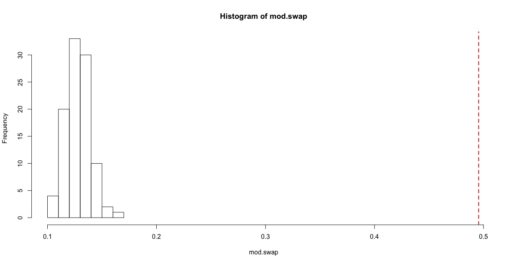

```{r setup, include=FALSE}
knitr::opts_chunk$set(echo = TRUE, fig.width=6, fig.height=4, fig.align='center',warning=F, message = F)
set.seed(2)
```

---

In this exercise, we will use data from our ongoing study on social networks of flock membership in a wintering population of golden-crowned sparrows, **Zonotrichia atricapilla** (Shizuka et al. 2014)3. Golden-crowned sparrows are long distance migrants that breed in western Canada and Alaska and winter along the west coast of mainland US. This work is based at a small (~7 ha) field site in California (UC Santa Cruz Arboretum) where golden-crowned sparrows are abundant during the non-breeding season (October-March). Since 2009, my colleagues and I have been collecting data on which individually-marked sparrows are observed together in flocks (typically 2-10 birds), defined as a collection of individuals within a 5m radius during a given observation. Flock membership changes within minutes—some birds leave and other birds join. Each year, we built a social network based on flock co-membership. In this paper, we showed that the social networks of wintering sparrows are highly clustered, with ‘social communities’ of individuals that flock together throughout the season. These social communities are somewhat fluid and spatially overlapping. Nevertheless, they seem to be quite stable across years--i.e., all birds leave for the breeding season, but those that come back tend to form the same clusters again. Moreover, we show using MRQAP analysis that past association (association index from the previous year) is a better predictor of current flock associations than a metric of home range overlap. That is, given that two individuals overlap in space, they are more likely to flock together if they had flocked together often in the previous year--a potential signature of social fidelity that bridges years.


I detail the process of making a network from raw observation data in another worked example [(Worked Example: Constructing Flock Network of Golden-crowned Sparrows)](example_make_sparrow_network.html). Let's consolidate the codes shown in that tutorial in one script here:

```{r}
library(tidyr) #or you can just load the whole tidyverse with library(tidyverse)
library(asnipe)
library(igraph)
```

```{r}
flock2=read.csv('https://datadryad.org/bitstream/handle/10255/dryad.63925/Flock_Season2_Dryad.csv')
flock3=read.csv('https://datadryad.org/bitstream/handle/10255/dryad.63926/Flock_Season3_Dryad.csv')
head(flock2)
```

```{r}
flock.list=list(flock2, flock3)
```

```{r}
m.list=lapply(flock.list, function(x) {
  birdcols=grep("Bird",colnames(x))
  ids=unique(gather(x[,birdcols])$value)
  ids=ids[is.na(ids)==F&ids!=""&ids!=" "]
  m1=apply(x[,birdcols],1,function(y) match(ids,y))
  m1[is.na(m1)]=0
  m1[m1>0]=1
  rownames(m1)=ids #rows are bird ids
  colnames(m1)=paste('flock', 1:ncol(m1), sep="_") #columns are flock IDs (just "flock_#")
  m2=m1[which(rowSums(m1)>3),]
  m2
})

adjs=lapply(m.list, function(x) get_network(t(x), data_format="GBI", association_index = "SRI")) # the adjacency matrix
gs=lapply(adjs, function(x) graph_from_adjacency_matrix(x, "undirected", weighted=T))#the igraph object

gs

```


Now, let’s plot these networks side-by-side. 

```{r}
seasons=c("Season 2", "Season 3") # save for plot title 
default=par() #save default graphical parameters first 
par(mfrow=c(1,2)) #set up to plot networks side-by-side 
for(i in 1:2){
plot(gs[[i]], edge.width=E(gs[[i]])$weight*10, vertex.label="", vertex.color="gold1", vertex.size=10,edge.color="gray10", main=paste(seasons[i]))
}
```

```{r}
par(default)
```

---

##Modularity of the networks

One of the first things we did in this study is to determine whether there were discrete clusters in this network that would suggest that there are multiple social communities within this small study area.

```{r}
coms=lapply(gs, function(x) cluster_fast_greedy(x)) #apply community detection function to each network
mods=sapply(coms, modularity) #calculate modularity based on community assignments
com.colors=list(c("blue", "yellow", "green", "red"), c("green", "blue", "red", "yellow")) # assign colors to communities. Community colors are in different order for each year because community ID number depends on the order of nodes that belong to them.
set.seed(10) #make plots reproducible 
par(mfrow=c(1,2))
for(i in 1:2){ 
  l=layout_with_fr(gs[[i]])
  V(gs[[i]])$color=com.colors[[i]][membership(coms[[i]])]
  plot(gs[[i]], layout=l, edge.width=E(gs[[i]])$weight*10, vertex.label="", vertex.size=10,edge.color="gray10", main=paste(seasons[i], ": Modularity=", round(mods[[i]], 2)))
}
par(default)
```

In both years, the network appears to be highly clustered. The colors of the clusters are assigned based on the consistency of the home ranges of each community across years (see Shizuka et al. 2014 for details).

**Note: Here and in the paper, we used a ‘fast and greedy’ community detection algorithm (Clauset, Newman & Moore 2004) because it performed best on our networks. More recently, I have confirmed that an alternative method called Simulated Annealing (which is reported to perform better on smaller networks: Guimerà and Amaral, 2005) yields nearly identical results.**


##Testing modularity of empirical network against randomized networks

####Randomized networks using group membership swaps

To see whether this pattern of network clustering is meaningful, we want to compare this against some kind of null model. For networks based on association data (e.g., individuals in groups), the basic null model should be constructed using a ‘group membership swap’ method first proposed by Manly (1995) and adapted to animal social data by Bejder (1998). The method is reviewed in detail in Whitehead et al. (2005). See the earlier section on group membership swaps in this handbook (Section 5.3). This swapping algorithm is available in two different functions within the `asnipe` package: `network_swap()` and `network_permutation()`. The two function are slightly different in how their outputs and are useful for different reasons.

There are generally two ways to generate a P-value using the group membership swapping algorithm. First, one could repeat the swaps until the test statistic of interest stabilizes to a range of values corresponding to a randomized matrix, and then repeat this procedure a large number of times to calculate a distribution of the test statistic under the null model (let’s call it the ‘global test’). Alternatively, one can run a large number of swaps from a single initial matrix, calculating a test statistic after each ‘swap’ of the matrix, and compare this distribution against the empirical test statistic (‘serial test’). Manly (1995) discusses why the serial method is a valid method for testing whether the empirical matrix is non-random as long as we conduct a very large number of swaps. The ‘serial test’ method is much more computationally efficient than the ‘global test’. In the paper, we used the ‘global method’ in which we conducted a large number of swaps and repeated this procedure 1,000 times. Below, I will show how to generate P-values using both the ‘global’ and ‘serial’ methods.


Global test: Let’s do 100 runs of the group membership swapping, with 500 swaps per run (in the paper, we conducted 1,000 runs of ~5,000 swaps). We will calculate modularity at the end of each iteration and then generate a histogram.

```{r, eval=F}
gbi=t(m.list[[1]]) 
swap.m=list() 
times=100
for (k in 1:times){
  swap.m[[k]]=network_swap(gbi, swaps=500)$Association_index }

swap.g=lapply(swap.m, function(x) graph_from_adjacency_matrix(x, "undirected", weighted=T)) 
mod.swap=sapply(swap.g, function(x) modularity(cluster_fast_greedy(x)))
```

```{r, eval=F}
hist(mod.swap, xlim=c(min(mod.swap), mods[[1]]))
abline(v=mods[[1]], col="red", lty=2, lwd=2) 
p=(length(which(mod.swap>=mods[[1]]))+1)/(times+1)
p
```

```{r, echo=F}

```
