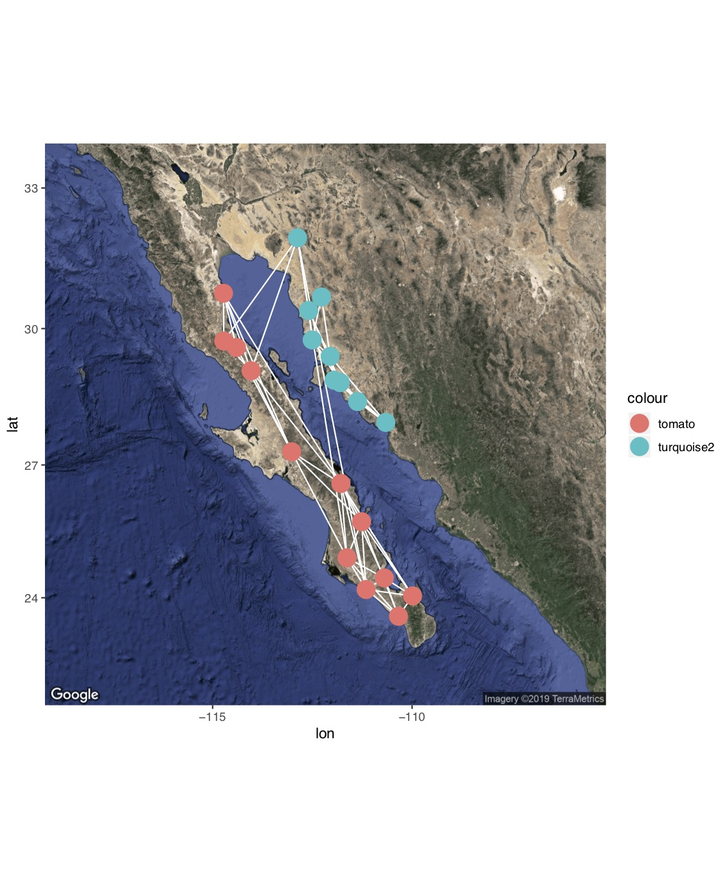

```{r setup, include=FALSE}
knitr::opts_chunk$set(echo = TRUE, fig.width=6, fig.height=4, fig.align='center',warning=F, message = F)
set.seed(2)
```

---


With spatial networks, the nodes represent spatial locations and the edges represent connections between those locations, e.g., ***habitat connectivity*** (*‘landscape connectivity networks’*: Urban & Keitt 2001, Urban et al. 2009), ***movements of individuals*** (**‘movement networks’**: Jacoby & Freeman 2016), ***genetic covariance among populations*** (**‘population graphs’**: Dyer & Nason 2004, Dyer 2015), ***migration pathways*** (**‘migratory flow networks’**: Taylor & Norris 2010, Knight et al. 2018). Such networks of connectivity between populations are important in a variety of fields including conservation biology, population genetics, evolution and metapopulation ecology.

Most concepts from other types of networks are transferrable to spatial networks. The main characteristic is that the spatial location of nodes are explicit here. However, also note that social networks will almost always have a spatial component to it, as social interactions happen in space. 

To explore this type of data, we will be demonstrating the construction of space-based networks using a dataset on genetic connectivity (‘population graph’) of the cactus **Lophocereus schottii** from Dyer & Nason (2004). We will be using an R package called `popgraph`, written by Rodney Dyer. A nice tutorial is available online (http://dyerlab.github.io/popgraph/), and the codes here are mostly adapted from this site.

```{r, echo=F, fig.cap="*Lophocereus schottii*, via wikimedia commons"}
knitr::include_graphics("https://upload.wikimedia.org/wikipedia/commons/thumb/7/76/P%C3%A1jara_La_Lajita_-_Oasis_Park_-_Pachycereus_schottii_01_ies.jpg/640px-P%C3%A1jara_La_Lajita_-_Oasis_Park_-_Pachycereus_schottii_01_ies.jpg")
```


##1. Importing and visualizing the network

First, we will import an adjacency matrix of genetic connectivity among sites in L. schottii (Dyer & Nason 2004). Nason et al. (2002) assayed 29 polymorphic allozyme loci from 948 individual cacti in 21 populations. This data was converted to a 21 x 21 genetic distance matrix. Then the pairs of populations that were (using a method called edge exclusion deviance--see Dyer and Nason 2004 for details). In the resulting network (i.e., ‘population graph’), sites are connected by an edge if they are genetically ‘significantly similar’ (i.e., there is gene flow).

Let’s read the data and take a look:

```{r}
lopnet=as.matrix(read.csv("https://dshizuka.github.io/NAOC2016/lopho_network.csv", header=T, row.names=1)) #From Dyer et al. 2004
lopnet
```

Now, let’s convert this into a graph object and plot it:
```{r}
library(igraph)
g=graph_from_adjacency_matrix(lopnet, mode="undirected") 
par(mar=c(2,2,2,2))
plot(g)
```
```{r, echo=F, results=F}
dev.off()
```

Again, in this network, each node represents a population and the edges connect populations that are significantly similar genetically.

##2. Using spatial data to plot networks

```{r}
locations=read.csv("https://dshizuka.github.io/NAOC2016/lopho_locations.csv") 
head(locations)
```

We can use these coordinates to plot the spatial network. We won’t worry about specific projection methods for converting coordinates to 2D. We can do this by creating a 2-column matrix of x- and y-coordinates and using this as the ‘layout’, which we can specify when plotting the network. While we’re at it, we will also color-code the nodes based on region:

```{r}
#create a two-column matrix of x- and y-coordinates
V(g)$x=locations[match(V(g)$name, locations$Population),"Long"] 
V(g)$y=locations[match(V(g)$name, locations$Population),"Lat"] 
l=matrix(c(V(g)$x, V(g)$y), ncol=2)
# color code nodes by region
regions=locations[match(V(g)$name, locations$Population),"Region"] 
V(g)$color=c("tomato", "turquoise2")[as.numeric(regions)]
par(mar=c(2,2,2,2))
plot(g, layout=l)
```

```{r, echo=F, results=F}
dev.off()
```


Now, let’s compare what the networks look like when using this ‘spatial layout’, compared to a force-directed layout (Fruchterman-Reingold), which is the default layout in igraph.

```{r}
par(mfrow=c(1,2), mar=c(2,2,2,2))
plot(g, layout=l, main="Spatial Layout")
plot(g, layout=layout_with_fr(g), main="Force-directed layout")
```

```{r, echo=F, results=F}
dev.off()
```


Comparing these network layouts, one thing pops out: one population (“SenBas”) is located in Sonora, but it clusters genetically with the Baja California populations. Geographically, it doesn’t seem to be particularly closer to the Baja populations, so what gives? It would be nice to ve able to see the underlying geographic features here...

##3. Making it a lot prettier using `popgraph`

Now, let’s make this spatial network much nicer using the `popgraph` package. This will allow us to make a figure that overlays this network on top of a satellite image. 
Beware: this package uses the package `ggplot2` for graphics, so the syntax may be unfamiliar to some of you.

***BIG NOTE:*** Starting mid-2018, google now requires an API key to download satellite maps. Thus, this will not work unless you register and get a key. I believe this is free, but you still need to register your credit card. 

Here is how you would do that:
```{r, eval=F}
library(popgraph)
library(ggmap)
register_google(key=" youhavetoenteryourkeyhere ")
```

```{r, echo=F}
library(popgraph)
library(ggmap)
```
After you have registered your API key, you can run this:

```{r, eval=F}
location = c( mean(V(g)$x), mean(V(g)$y))
map = get_map(location ,maptype="satellite", zoom=6) #use ggmap to get a satellite image of the study area.
p = ggmap( map ) #plot will include this image
p = p + geom_edgeset(aes(x=x, y=y), g, color="white") #plot will also include the network edges, in white
p = p + geom_nodeset(aes(x=x, y=y, color=color), g, size=4) #plot will also include the network nodes, color-coded by region
p #plot color
```

```{r, echo=F}

```

If you don't want to get an API key, you can use other databases supported in the `ggmap` package, such as `get_stamenmap()`. This will not let you do a satellite image, but you can make pretty graphs nonetheless.

```{r}
location = c( mean(V(g)$x), mean(V(g)$y))
map=get_stamenmap(location, bbox=c(left=-118, bottom=20, right=-108, top=35), zoom=6, source="stamen", maptype="watercolor")

p=ggmap(map)
p = p + geom_edgeset(aes(x=x, y=y), g, color="black") #plot will also include the network edges, in white
p = p + geom_nodeset(aes(x=x, y=y, color=color), g, size=4) #plot will also include the network nodes, color-coded by region
p #plot color
```


##4. Overlaying a spatial network on a plain map

Alternatively, you can use a combination of `mapproj` and `geosphere` package to overlay a spatial network on a simple map. This is based on code posted by Dr. Katya Ognyanova on her [website.](http://kateto.net/network-visualization)

```{r, fig.height=8}
library(maps)
library(geosphere)
library(mapproj)

par(mar=c(2,2,2,2))

#make an edge list where you store all the edge information
edges=as_data_frame(g)
colnames(edges)=c("v1", "v2")

#plot a map, focusing in on Baja California
map(database="world", xlim=c(-118,-108), ylim=c(20, 35), col="gray",fill=T)

#now add edges iteratively using the `gcIntermediate()` function in `geosphere`
for(i in 1:nrow(edges))  {
  node1 <- locations[locations$Population == edges[i,"v1"],]
  node2 <- locations[locations$Population == edges[i,"v2"],]
  
  arc <- gcIntermediate( c(node1$Long, node1$Lat), 
                         c(node2$Long, node2$Lat), 
                         n=1000, addStartEnd=TRUE )
  
  lines(arc, lwd=2)
}

#now add the nodes (adding the nodes second plots it on top of the lines, making it look nicer).
points(x=locations$Long, y=locations$Lat, pch=21, 
       cex=3, bg=c("tomato", "turquoise2")[as.numeric(locations$Region)])
```